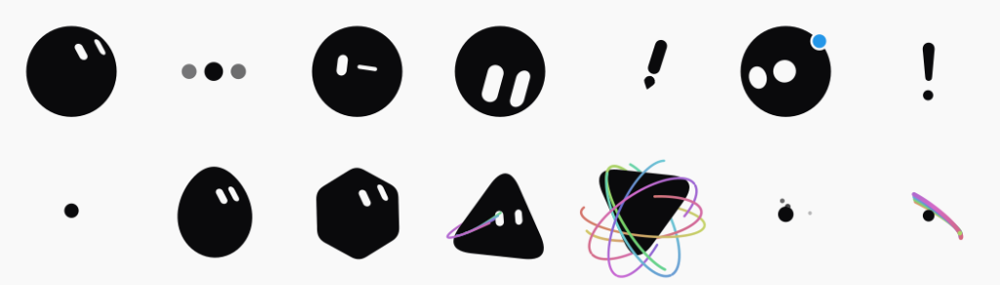
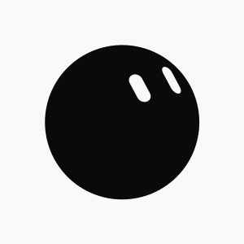

# Reactive Bloub Flutter 🫧




An animated, procedurally-rendered mascot avatar for Flutter. Every frame is computed live — no sprite sheets, no Lottie files — so shapes, expressions, and animated states cross-fade smoothly into each other and blend in any combination!

It's perfect for virtual assistants, gamification, onboarding, loading screens, or any place where you need a bit of personality and life in your app. 💙

## Features ✨

- **12+ Shapes** — Circle, pebble, squircle, capsule, triangle, cloud, droplet, flame, medal, acorn, jellyfish, clover. (Shapes morph fluidly!)
- **12+ Expressions** — Neutral, happy, excited, sad, angry, curious, proud, shy, and more.
- **15 Animated States** — Idle, thinking, wink, alert, notify, exclaim, sleep, play, orbit, burst, comet, and more.
- **Customizable Colors** — Choose from predefined beautiful palettes or pass your own custom `Color` and let Bloub shade it for you.
- **Vibrant Effects** — Notifications, orbital rings, and particle effects map to vivid gradients and smooth animations.
- **Gaze Tracking** — Tell the mascot where to look (yaw & pitch) to track pointers, text fields, or users.
- **Headless Export** — Export the mascot's current pose as a PNG for share cards and thumbnails.

---

## Getting Started

Add the package to your `pubspec.yaml`:

```yaml
dependencies:
  reactive_bloub: ^0.1.0
```

---

## Usage

Using Bloub is incredibly simple. You manage its state through `BloubController` and render it with `BloubAvatar`.

```dart
import 'package:reactive_bloub/reactive_bloub.dart';

// 1. Create a controller
final controller = BloubController(
  initialShape: BloubShape.circle,
  initialPredefinedColor: BloubPredefinedColor.blue,
);

// 2. Add it to your UI
BloubAvatar(
  controller: controller, 
  size: 120, // Customize the size!
)
```

### High-level Reactions 🎭

Bloub comes with handy methods to orchestrate sequences (like playing an animation and returning to idle):

```dart
// A right or wrong answer — plays a reaction, then returns to idle on its own
controller.react(correct: true);

// A bigger celebration — e.g. level complete or milestone reached
controller.celebrate();

// While something is loading — loops until you call idle()/react()/celebrate()
controller.think();

// Back to resting
controller.idle();
```

### Morphing Shapes, Colors, and Expressions 🎨

You can mutate the mascot at any time. It will animate and fluidly interpolate to the new configuration!

```dart
// Change shape
controller.setShape(BloubShape.cloud);

// Change color
controller.setColor(predefined: BloubPredefinedColor.teal);
// OR use a custom brand color:
// controller.setColor(custom: const Color(0xFF41D1FF));

// Change expression
controller.setExpression(BloubExpression.curious);
```

### Gaze Tracking 👀

Make your app feel alive by having the mascot follow UI elements or the user's cursor:

```dart
// Look towards a specific direction (-90 to 90 degrees)
controller.lookAt(yaw: 20, pitch: -10);

// Reset gaze back to center
controller.resetGaze();
```

### Rendering to PNG 📸

Export the current frame as a static PNG. This is great for dynamic share-cards, profile pictures, or static fallbacks.

```dart
final bytes = await controller.exportAsPng(size: 512);
```

---

## Advanced Usage

### Understanding States

Animations are categorized into two paradigms:
1. **Sustained States** (`.idle`, `.thinking`, `.notify`, `.sleep`): These loop indefinitely as long as you leave the avatar in them.
2. **One-Shot States** (`.exclaim`, `.alert`, `.wink`, `.comet`): These play a fixed pose once and then hold their last frame. 

If you set a one-shot state directly via `controller.setState(BloubState.exclaim)`, it will not return to idle automatically. Usually, it's better to use `react()` or `celebrate()` which schedules the sequence back to `.idle` for you.

### Example App

Check out the `example/` folder for a full playground where you can toggle every single shape, expression, and state, pick colors, and test out animations.

---

made with ❤️ by [arinbuilds](https://x.com/ArinBuilds)
